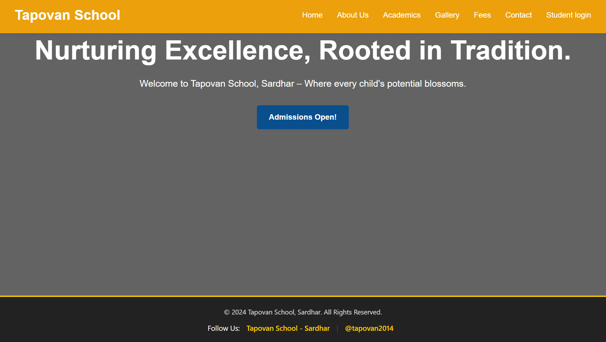
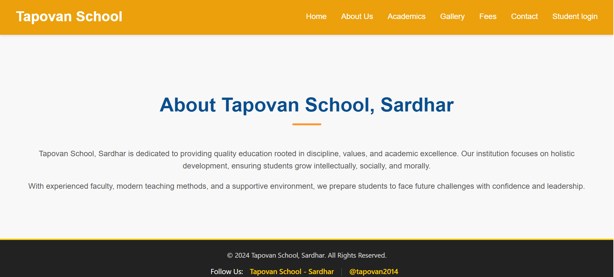
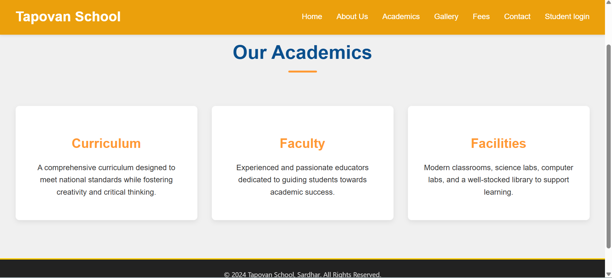
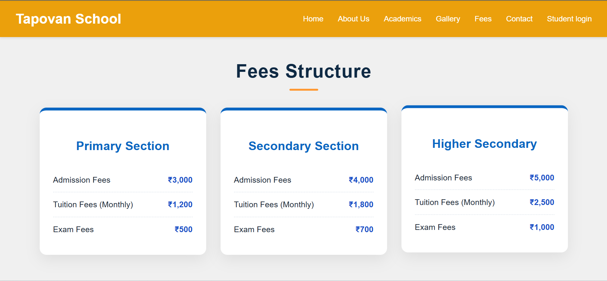
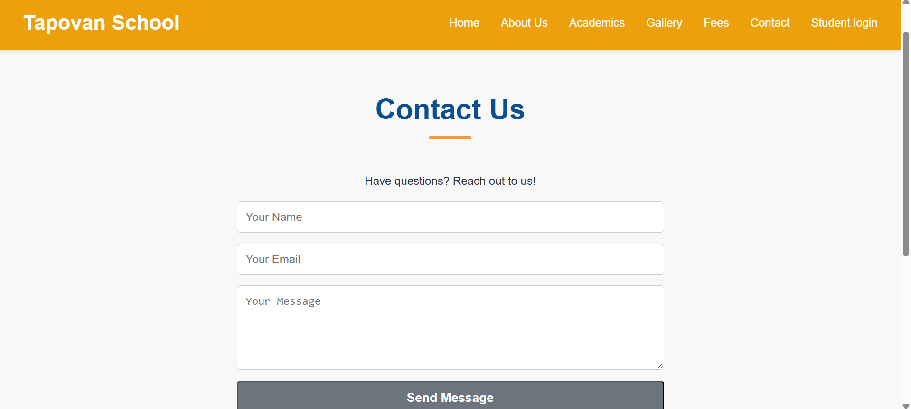
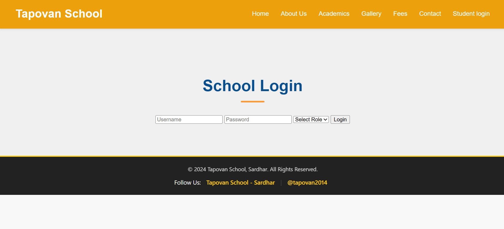
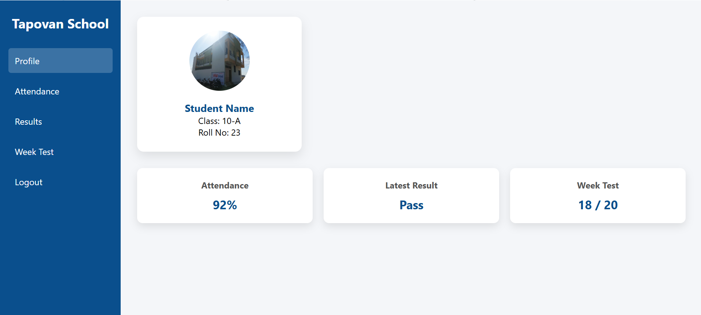
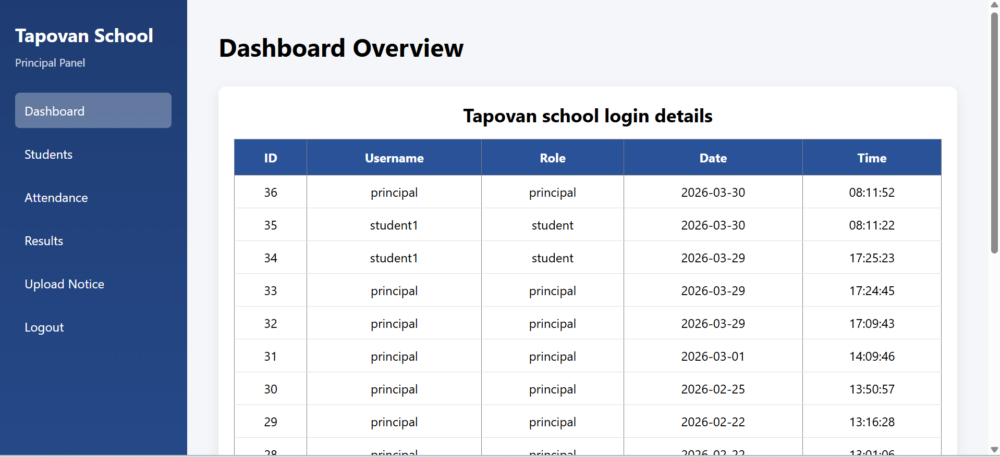

# 🎓 Tapovan School Management System

Tapovan School is a PHP and MySQL based web application developed as a BCA Semester 2 academic project. This system runs on XAMPP local server and provides secure login functionality for Principal (Admin) and Students with role-based dashboard access and login activity tracking.

--

## 🚀 Features

- 🔐 Secure Login System (Student & Principal)
- 👤 Role-Based Access Control
- 🗂 Session Management
- 📝 Login Logs with Date & Time Tracking
- 📊 Principal Dashboard
- 🎓 Student Dashboard
- 💾 MySQL Database Integration
- 📱 Basic Responsive Layout

---

## 🛠 Technologies Used

- PHP
- MySQL
- HTML5
- CSS3
- XAMPP (Apache & MySQL)

---

## 🗄 Database Structure

### Users Table
- id
- username
- password
- role

### Login Logs Table
- id
- username
- role
- login_date
- login_time

---

## ⚙ Installation Guide (XAMPP)

1. Install XAMPP.
2. Start Apache and MySQL.
3. Open phpMyAdmin.
4. Create a new database.
5. Import the SQL file.
6. Update config.php with database credentials.
7. Place the project folder inside:
